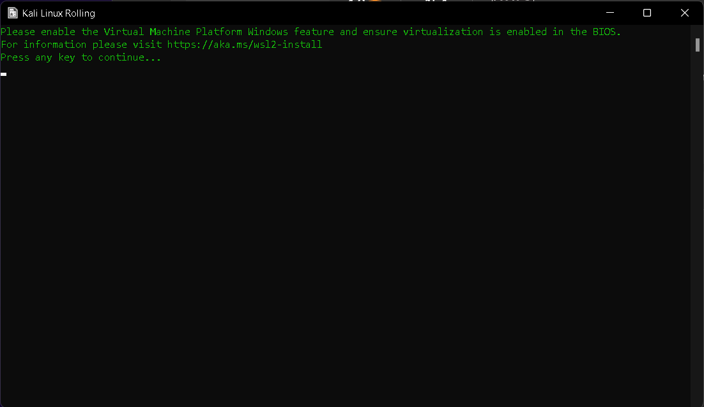

<!--markdown tutorial-->
Subrata Ghosh  
This is second line<hr/>

 # subrata ghosh
 ## subrata ghosh
 ### subrata ghosh
 #### subrata ghosh
 ##### subrata ghosh
 ###### subrata ghosh

<p>this is subrata ghosh . i am 20 now. i am persuing my b.tech. from mieat under makut university.</p>

<i>this a italic text</i>  
_this a italic text_  
__this a italic text__  

<del>this is strikethrough text</del>

~~this strikethrough text in markdown~~  

`this is inline`  
`<h1>this is inline</h1>`

<br/>

```
<html>
<title>ths is title</title>
<body>i am boss </body>
</html>

```

```html
<html>
<title>ths is title</title>
<body>i am boss </body>
</html>

```

```javascript
console.log('hellow')
```
<ol>
   <li>this is item 1</li>
   <li>this is item 2</li>
</ol>   

<br/>

### this is order list
1. item1  
2. item2  
    1. item.1  
    1. item.2
3. item3

<br/>

### unorder list
- item1
    - item 1.1
- item2
- item 3

<br/>

### task list
-  [x] item1
-  [x] item2
-  [] item 3

<br/>

### automatic link
https://nilranbow.blogspot.com

### disable link
`https://nilranbow.blogspot.com`

<br/>

### markdown link syntex 1:
[nilranbow](https://nilranbow.blogspot.com)


### markdown link syntex 2:
[nilranbow][websitelink]  
[facebook][websitelink2]

<!--all link is here-->
[websitelink]: https://nilranbow.blogspot.com
[websitelink2]: https://facebook.com

<br/>

### image syntex :
<!-- 
 
-->


<br/>

### add table :
| Name | email |
| ---- | ----------|
|subrata ghosh | email@gmail.com |
|subrata ghosh | email@gmail.com |
|subrata ghosh | email@gmail.com |